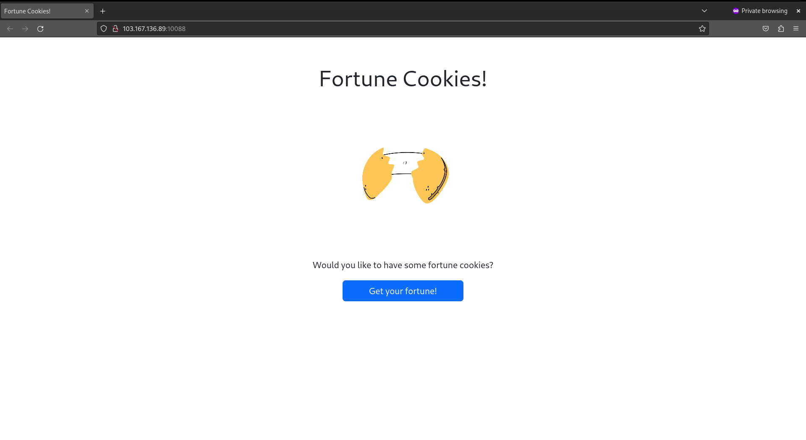

# Fortune Cookies - Cookie Exploitation

> Would you like to have some fortune cookies?

## About This Challenge

Terdapat sebuah website dengan tampilan sebagai berikut:

Tampaknya tidak ada yang salah dari website tersebut. Klik tombol "Get your fortune!" dan lihat kejutannya.

Ya, muncullah kata-kata positif secara acak. Namun yang diminta di sini bukanlah membangun _quotes_.

Pada clue terdapat tautan: . Materi yang cukup bagus, terutama bagi yang belum mengenal apa itu cookie untuk website.

By the way, cookie di sini adalah petunjuk dalam mendapatkan flag pada tantangan ini. Tentu saja, bukan cookie untuk dimakan.

Pada peramban web (saya pakai F\*refox btw), tekan F12 pada papan ketik untuk inspeksi elemen. Kemudian pada tab Storage, cek bagian Cookies.

Ada dua cookie. Cookie pertama adalah "flag" yang bernilai 0, dan cookie lainnya adalah "PHPSESSID", yang memiliki nilai berupa deretan angka dan huruf heksadesimal, yang saya pun pusing membacanya.

Kuncinya ada pada cookie "flag". Ubah nilainya menjadi satu dan klik tombol birunya...

FLAG: ForestyHC{here_is_your_fortun3_cookie_4a0a47}

 
