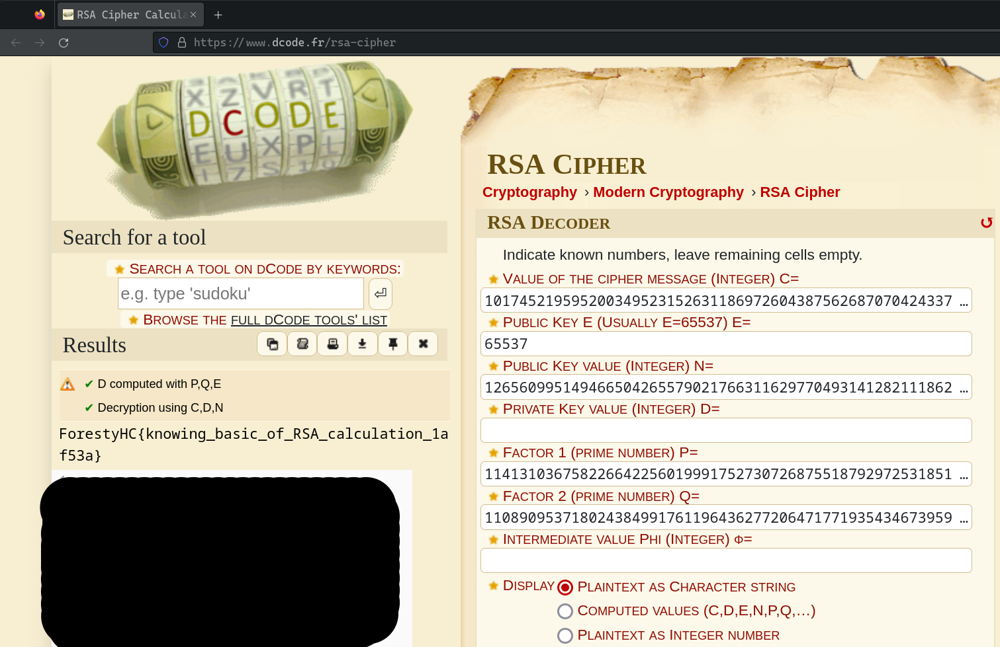

# RSA

## About This Challenge

Diberikan clue berupa file text `output.txt`


Dari file tersebut, dapat diketahui bahwa flag disembunyikan dalam RSA Cipher.

## Solution

### Cara cepat

Untuk cara cepatnya, bisa langsung menggunakan decipher online yang gratis, seperti https://www.dcode.fr/rsa-cipher

Tinggal masukkan saja nilai P, Q, N, E, dan C ke dalam field yang sesuai.



Flag: 
```
ForestyHC{knowing_basic_of_RSA_calculation_1af53a}
```
