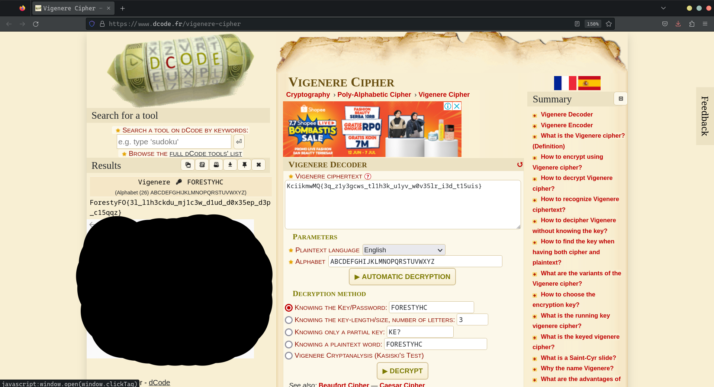

# Vigenere

> You have stumbled upon a suspicious piece of encrypted text. It appears to be encrypted using some cipher. Your task is to decrypt the message and uncover the hidden flag within.

> Encrypted Flag: KciikmwMQ{3q_z1y3gcws_tl1h3k_u1yv_w0v35lr_i3d_t15uis}

> Format Flag: ForestyHC{flag}

## About this Challenge

As the name suggest, kita gunakan metode decipher untuk Vigenere cipher. Ada banyak decipher online gratis untuk Vigenere cipher, salah satunya https://www.dcode.fr/vigenere-cipher.


Masukkan Encrypted flag ke dalam text box Vigenere ciphertext, dan pada opsi "Knowing the Key/Password", masukkan string "FORESTYHC" (tanpa tanda petik).



Flag: 
```
ForestyFO{3l_l1h3ckdu_mj1c3w_d1ud_d0x35ep_d3p_c15qqz}
```
